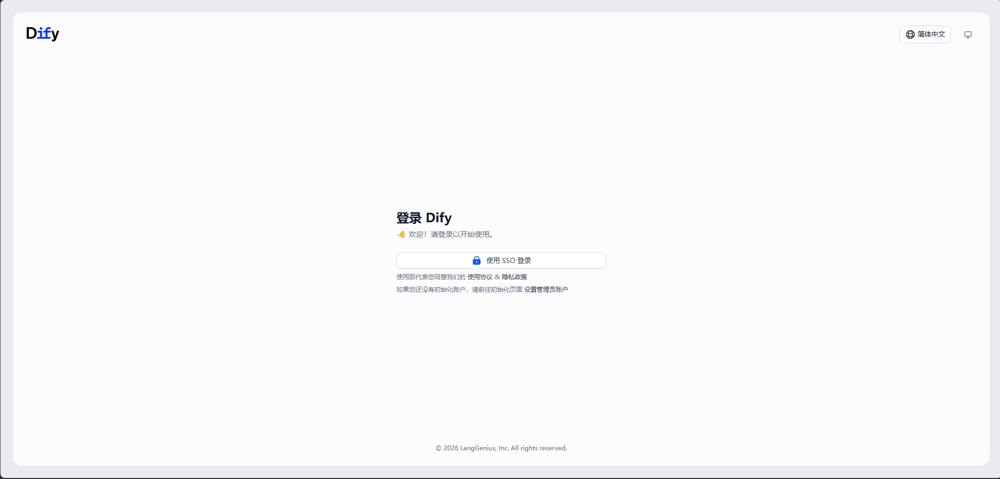
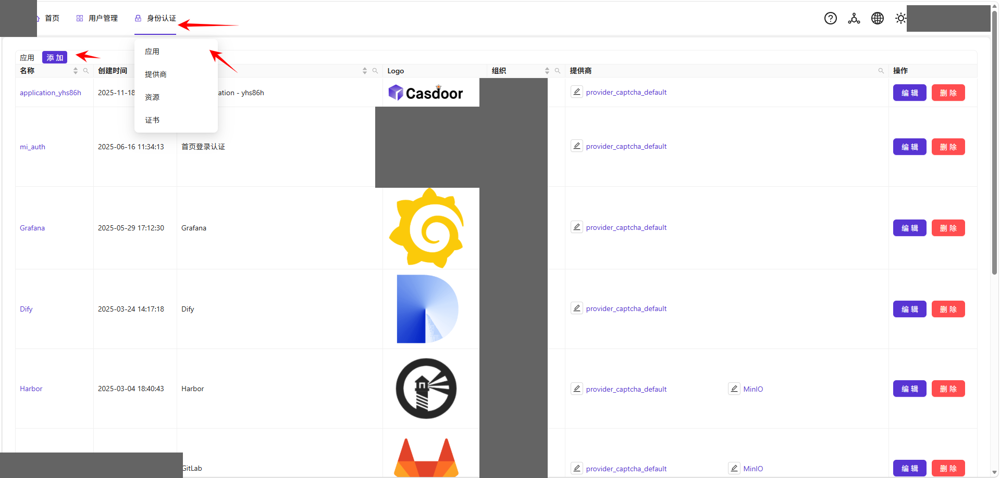
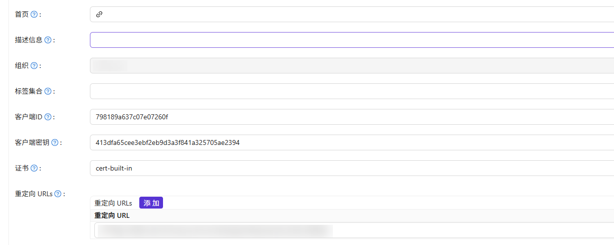

## 一、概述

### 1、说明

​	本项目基于[lework/dify-sso: dify login extension sso, oidc](https://github.com/lework/dify-sso)项目进行修改，使其能够支持最新版的Dify进行SSO认证，方便对接各种企业内部的登陆系统，支持标准SSO协议。`dify-sso`项目说明请查看原项目或当前项目下的`README_ORIGIN.md`文件。

​	当前代码在`1.13.1`版本验证通过，兼容老版本。


### 2、环境要求

* docker
* docker-compose
* dify 1.13.1+
* 在dify同台机器上配置，与dify公用数据库和redis。


### 3、展示

实现访问Dify地址，自动跳转到以下登录地址，点击`使用SSO登录`即可跳转到登陆地址。




## 二、配置

### 1、创建配置文件

```bash
mv .env.example .env
```

`.env`文件中为各种环境变量，其内容如下，下面分别配置，内容大部分来自于Dify的`.env`文件：

```bash
# 服务配置
CONSOLE_WEB_URL=https://dify.local.example.com
SECRET_KEY=sk-9f73s3ljTXVcMT3Blb3ljTqtsKiGHXVcMT3BlbkFJLK7U
TENANT_ID=47f8b62e-5041-4f16-a728-5064d48d6536
EDITION=SELF_HOSTED
ACCOUNT_DEFAULT_ROLE=normal

# 令牌配置
ACCESS_TOKEN_EXPIRE_MINUTES=60
REFRESH_TOKEN_EXPIRE_DAYS=30
REFRESH_TOKEN_PREFIX=refresh_token:
ACCOUNT_REFRESH_TOKEN_PREFIX=account_refresh_token:

# OIDC配置
OIDC_CLIENT_ID=798189a637c07e07260f
OIDC_CLIENT_SECRET=413dfa65cee3ebf2eb9d3a3f841a325705ae2394
OIDC_DISCOVERY_URL=https://auth.local.example.com/.well-known/openid-configuration
OIDC_REDIRECT_URI=https://dify.local.example.com/console/api/enterprise/sso/oidc/callback
OIDC_SCOPE=openid profile email roles
OIDC_RESPONSE_TYPE=code

# 数据库配置
DB_USERNAME=postgres
DB_PASSWORD=difyai123456
DB_HOST=db_postgres
DB_PORT=5432
DB_DATABASE=dify

# Redis配置
REDIS_SERIALIZATION_PROTOCOL=2
REDIS_HOST=redis
REDIS_PORT=6379
REDIS_DB=0
REDIS_PASSWORD=difyai123456
```


### 2、服务配置

```bash
CONSOLE_WEB_URL=https://dify.local.example.com
SECRET_KEY=sk-9f73s3ljTXVcMT3Blb3ljTqtsKiGHXVcMT3BlbkFJLK7U
TENANT_ID=47f8b62e-5041-4f16-a728-5064d48d6536
EDITION=SELF_HOSTED
ACCOUNT_DEFAULT_ROLE=normal
```

* `CONSOLE_WEB_URL`： Dify的访问地址，可以是原始的IP，也可以是外部反带的域名；

* `SECRET_KEY`：来自部署Dify时的`.env`文件，可通过以下命令查看，DIFY_DIR替换为自己的路径：

  ```bash
  cat ${DIFY_DIR}/docker/.env | grep SECRET_KEY | head -n 1
  ```

* `TENANT_ID`：为工作空间ID，查阅数据库获得，若能够直接连接Dify的数据库，则前往dify.tenants表中查看，若不能进入，则可以直接进入容器查看，命令如下：

  ```bash
  # 1、查找dify数据库名称
  docker ps -a | grep -i postgre
  
  ## 输出类似如下,通过容器名或容器ID进入都可：
  : <<EOF
  111e21be74f2   postgres:15-alpine                              "docker-entrypoint.s…"    3 hours ago   Up About an hour (healthy)   5432/tcp                                                                       docker-db_postgres-1
  EOF
  
  # 2、进入dify数据库终端
  docker exec -it docker-db_postgres-1 psql -U postgres -d dify
  
  # 3、找到 tenant
  SELECT id,name FROM tenants;
  
  ## 输出内容类似如下，根据名称找到对应工作空间ID：
  : <<EOF
                    id                  |  name   
  --------------------------------------+---------
   47f8b62e-5041-4f16-a728-5064d48d6536 | Dify
  (1 row)
  EOF
  ```

* `EDITION`：固定值，`SELF_HOSTED`，代表私有部署版本；

* `ACCOUNT_DEFAULT_ROLE`： SSO登陆后的用户默认身份，可选值: `normal`, `editor`, `admin`，分别对应`成员`、`编辑者`和`管理员`。


### 3、令牌配置

无需配置，保持默认即可


### 4、OIDC配置

```bash
OIDC_CLIENT_ID=798189a637c07e07260f
OIDC_CLIENT_SECRET=413dfa65cee3ebf2eb9d3a3f841a325705ae2394
OIDC_DISCOVERY_URL=https://auth.local.example.com/.well-known/openid-configuration
OIDC_REDIRECT_URI=https://dify.local.example.com/console/api/enterprise/sso/oidc/callback
OIDC_SCOPE=openid profile email roles
OIDC_RESPONSE_TYPE=code
```

此处以`Casdoor`为例，配置单点登录：

#### （1）添加应用

登录`Casdoor`，点击`身份认证`->`应用`->`添加`



#### （2）配置

主要配置以下几处：



* `客户端ID`：自动生成，对应`OIDC_CLIENT_ID`；
* `客户端密钥`：自动生成，对应`OIDC_CLIENT_SECRET`；
* `重定向URLs`：填写`{Dify地址}/console/api/enterprise/sso/oidc/callback`，对应`OIDC_REDIRECT_URI`的值；
* `OIDC_DISCOVERY_URL`：填写`{Dify地址}/.well-known/openid-configuration`
* `OIDC_SCOPE`：保持默认。
* `OIDC_RESPONSE_TYPE`：保持默认。


### 5、数据库配置

```bash
DB_USERNAME=postgres
DB_PASSWORD=difyai123456
DB_HOST=db_postgres
DB_PORT=5432
DB_DATABASE=dify
```

以上均是通过查看Dify `.env`文件查看，若部署Dify时指定了外部数据库，则自定修改：

* `DB_USERNAME`：

  ```bash
  cat ${DIFY_DIR}/docker/.env | grep -i DB_USERNAME | head -n 1
  ```

* `DB_PASSWORD`：

  ```bash
  cat ${DIFY_DIR}/docker/.env | grep -i DB_PASSWORD | head -n 1
  ```

* `DB_HOST`：

  ```bash
  cat ${DIFY_DIR}/docker/.env | grep -i DB_USERNAME | head -n 1
  ```

* `DB_DATABASE`:

  ```bash
  cat ${DIFY_DIR}/docker/.env | grep -i DB_USERNAME | head -n 1
  ```

  

### 6、Redis配置

```bash
REDIS_SERIALIZATION_PROTOCOL=2
REDIS_HOST=redis
REDIS_PORT=6379
REDIS_DB=0
REDIS_PASSWORD=difyai123456
```

以上均是通过查看Dify `.env`文件查看，若部署Dify时指定了外部Redis，则自定修改：

* REDIS_SERIALIZATION_PROTOCOL：固定值

* REDIS_HOST：

  ```bash
  cat ${DIFY_DIR}/docker/.env | grep -i REDIS_HOST | head -n 1
  ```

* `REDIS_PORT`:

  ```bash
  cat ${DIFY_DIR}/docker/.env | grep -i REDIS_PORT | head -n 1
  ```

* `REDIS_DB`：

  ```bash
  cat ${DIFY_DIR}/docker/.env | grep -i REDIS_DB | head -n 1
  ```

* `REDIS_PASSWORD`：

  ```bash
  cat ${DIFY_DIR}/docker/.env | grep -i REDIS_PASSWORD | head -n 1
  ```


### 7、Nginx配置

#### （1）修改

此处配置的是Dify的Nginx，可直接修改Dify内部的nginx，也可修改外部的nginx，内部的nginx修改如下，外部类似：

```bash
cd ${DIFY_DIR}/docker/nginx/conf.d
vim default.conf.template  # 修改default.conf.template而非default.conf，default.conf.template文件重启nginx容器后自动生成default.conf
```


#### （2）修改内容

在`/console/api`上方添加，优先级需要比较高，`http://dify-sso:8000`修改为实际的地址，此处`dify-sso`为部署的`dify-sso`容器名称，确保部署`dify-sso`，若`dify-sso`与`dify`不在同一台机器上，则可以使用IP+端口：

```nginx
    location ~ (/console/api/system-features|/console/api/enterprise/sso/) {
          proxy_pass http://dify-sso:8000;
          include proxy.conf;
    }
```

修改后的`default.conf.template`内容如下：

```nginx
# Please do not directly edit this file. Instead, modify the .env variables related to NGINX configuration.

server {
    listen ${NGINX_PORT};
    server_name ${NGINX_SERVER_NAME};
    
    location ~ (/console/api/system-features|/console/api/enterprise/sso/) {
          proxy_pass http://dify-sso:8000;
          include proxy.conf;
    }

    location /console/api {
      proxy_pass http://api:5001;
      include proxy.conf;
    }

    location /api {
      proxy_pass http://api:5001;
      include proxy.conf;
    }

    location /v1 {
      proxy_pass http://api:5001;
      include proxy.conf;
    }

    location /files {
      proxy_pass http://api:5001;
      include proxy.conf;
    }

    location /explore {
      proxy_pass http://web:3000;
      include proxy.conf;
    }

    location /e/ {
      proxy_pass http://plugin_daemon:5002;
      proxy_set_header Dify-Hook-Url $scheme://$host$request_uri;
      include proxy.conf;
    }

    location / {
      proxy_pass http://web:3000;
      include proxy.conf;
    }

    location /mcp {
      proxy_pass http://api:5001;
      include proxy.conf;
    }

    location /triggers {
      proxy_pass http://api:5001;
      include proxy.conf;
    }
    
    # placeholder for acme challenge location
    ${ACME_CHALLENGE_LOCATION}

    # placeholder for https config defined in https.conf.template
    ${HTTPS_CONFIG}
}
```


#### （3）重启nginx

重启nginx确保在`dify-sso`容器部署完成后进行，否则可能出现问题，部署`dify-sso`见下一章内容。


## 三、部署

### 1、docker独立部署

```bash
docker run \
    -itd \
    --restart=always \
    --name=dify-sso \
    --hostname=dify-sso \
    --network docker_default \
    -p 8000:8000 \
    --env-file /root/dify-sso/.env \
    ghcr.io/xjfyt/dify-sso:latest
```

* 若不存在镜像，可自定构建：`docker build -t ghcr.io/xjfyt/dify-sso:latest .`

* 对外暴漏的端口可以暴漏，也可以不暴漏，不暴漏确保dify nginx的配置中使用的是hostname访问，而非ip；

* `--env-file`指定配置文件路径。

* `--network`：指定网络，确保指定的网络是数据库容器所在网络，相关命令如下：

  ```
  # 1、列出所有网络
  docker network ls
  
  # 2、检查某个网络（可看到对应容器）
  docker network inspect docker_default
  ```

* Dify内网镜像地址为`ghcr.io/xjfyt/dify-sso:latest`，外网镜像地址为`crpi-wgxdim2jei2zq776.cn-`

* Dify内网镜像地址为`ghcr.io/xjfyt/dify-sso:latest`，外网镜像地址为`crpi-wgxdim2jei2zq776.cn-hangzhou.personal.cr.aliyuncs.com/dify/dify-sso:2026-04-09`，镜像均支持amd64和amr64架构。


### 2、合并到dify的docker-compose文件中

查看`yaml/docker-compose.yaml`文件，将其合并到dify的配置文件中即可，其中的环境变量按照`二、配置`中进行修改。


### 3、本地运行

#### （1）安装环境

```bash
uv sync
```


#### （2）运行

运行前确保`.env`文件已正确配置。

```bash
uv run -m app.main
```


## 四、其他

### 1、修改workspace所有权

#### （1）说明

​	社区版的Dify修改workspace的所有权时，需要验证邮箱，管理员用户无法直接修改用户权限，私有部署的Dify，其邮箱可能是不存在的，可以通过修改数据库的方式来修改。

​	在 Dify 里，👉 Workspace 所有权其实就是：

```
tenant_account_joins.role = owner
```

也就是说：

- 谁在这个表里是 `owner`
- 谁就是 Workspace 所有者

一共涉及到三张表：

| 表                   | 作用          |
| -------------------- | ------------- |
| tenants              | 工作空间      |
| accounts             | 用户          |
| tenant_account_joins | 用户-空间关系 |


#### （2）进入数据库

```bash
docker exec -it <postgres容器> psql -U postgres -d dify
```


#### （3）找到目标用户

```sql
SELECT id, email FROM accounts;
```

找到：

- 当前 owner
- 目标用户


#### （4）找到 tenant

```sql
SELECT id, name FROM tenants;
```


#### （5）找到当前`workspace`的`owner`

```sql
SELECT * FROM tenant_account_joins WHERE tenant_id = '你的tenant_id' AND role = 'owner';
```


#### （6）修改

```sql
-- 原 owner → admin
UPDATE tenant_account_joins SET role = 'admin' WHERE tenant_id = '你的tenant_id' AND account_id = '原ownerID';

-- 新 owner
UPDATE tenant_account_joins SET role = 'owner' WHERE tenant_id = '你的tenant_id' and account_id = '新用户ID';
```

